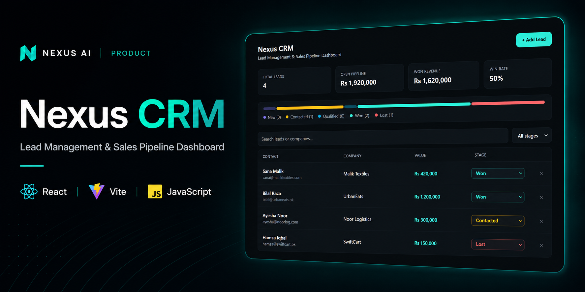
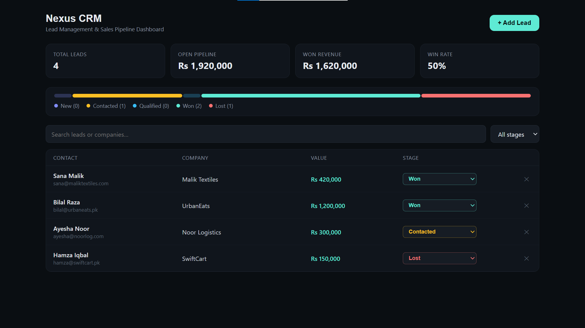
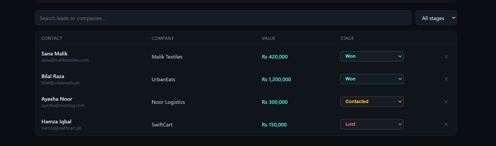
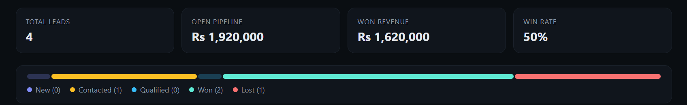

<p align="center">
  
</p>

<br>

# Nexus CRM

Lead Management & Sales Pipeline Dashboard

A React-based CRM application for managing leads, tracking sales opportunities, and monitoring pipeline performance through a clean and responsive dashboard.

<p align="center">

<a href="https://nexus-crm-azure.vercel.app/">Live Demo</a> •
<a href="https://github.com/aazmirkhan/NEXUS-CRM">Source Code</a>

</p>

---

## Overview

Nexus CRM is a frontend CRM application built with React and Vite.

The application provides lead management, sales pipeline tracking, dashboard analytics, search functionality, and browser-based data persistence. Version 1 focuses on delivering a lightweight CRM experience without requiring a backend or external database.

This project is part of the **Nexus AI** ecosystem and demonstrates modern frontend architecture, reusable UI design, and practical CRM workflows.

---

## Features

| Feature | Description |
|----------|-------------|
| Lead Management | Create, organize, and manage customer leads |
| Sales Pipeline | Track leads across multiple sales stages |
| Dashboard | View key CRM metrics and pipeline statistics |
| Search & Filtering | Quickly locate leads by name or company |
| Data Persistence | Store application data using browser localStorage |
| Responsive UI | Optimized for desktop, tablet, and mobile devices |

---

## Architecture

```text
                     User
                       │
                       ▼
                React Frontend
                       │
          ┌────────────┼────────────┐
          │            │            │
          ▼            ▼            ▼
   Lead Management   Dashboard   Search & Filter
          │
          ▼
   Browser localStorage
```

The application is entirely frontend-driven. All lead information is stored in the browser using localStorage, allowing data to persist between sessions without requiring a backend service.

---

## Technology Stack

| Category | Technology |
|----------|------------|
| Frontend | React 18 |
| Language | JavaScript (ES6+) |
| Build Tool | Vite |
| Styling | CSS |
| State Management | React Hooks |
| Storage | Browser localStorage |
| Deployment | Vercel |

---

## Project Structure

```text
NEXUS-CRM/
│
├── src/
│   ├── App.jsx
│   └── main.jsx
│
├── index.html
├── package.json
├── vite.config.js
├── README.md
├── LICENSE
└── .gitignore
```

---

## Screenshots

### Dashboard



---

### Lead Management



---

### Sales Pipeline



---

## Getting Started

### Prerequisites

- Node.js 18+
- npm

### Installation

Clone the repository.

```bash
git clone https://github.com/aazmirkhan/NEXUS-CRM.git
```

Navigate to the project directory.

```bash
cd NEXUS-CRM
```

Install project dependencies.

```bash
npm install
```

Start the development server.

```bash
npm run dev
```

The application will be available at:

```text
http://localhost:5173
```

---

## Development

Run the development server.

```bash
npm run dev
```

---

## Production Build

Create an optimized production build.

```bash
npm run build
```

Preview the production build locally.

```bash
npm run preview
```

---

## Core Modules

| Module | Description |
|----------|-------------|
| Dashboard | Displays key CRM metrics and pipeline statistics |
| Lead Management | Create, manage, and organize customer leads |
| Sales Pipeline | Track lead progression through sales stages |
| Search & Filtering | Locate leads using search and stage filters |
| Local Storage | Persists application data using browser localStorage |

---

## Deployment

The application is deployed on **Vercel**.

| Environment | URL |
|-------------|-----|
| Production | https://nexus-crm-azure.vercel.app/ |

---

## Roadmap

The following enhancements are planned for future releases.

| Version | Planned Features |
|----------|------------------|
| Version 2 | Authentication & User Management |
| Version 2 | Database Integration |
| Version 2 | AI Lead Assistant |
| Version 2 | Email Automation |
| Version 2 | AI Voice Agent |
| Version 2 | Workflow Automation |
| Version 2 | Advanced Analytics |
| Version 2 | GoHighLevel Integration |

---

## Future Improvements

- Component-based architecture
- Backend API integration
- Team collaboration
- Activity timeline
- File attachments
- Notification system
- Email templates
- Reporting dashboard
- Role-based access control

---

## Repository Information

| Resource | Link |
|----------|------|
| Live Demo | https://nexus-crm-azure.vercel.app/ |
| Source Code | https://github.com/aazmirkhan/NEXUS-CRM |

---

## Contributing

Contributions, feature requests, and improvements are welcome.

If you would like to contribute:

1. Fork the repository.
2. Create a feature branch.
3. Commit your changes.
4. Open a Pull Request.

---

## License

This project is licensed under the MIT License.

See the [LICENSE](LICENSE) file for additional information.

---

## Author

**Aazmir Ali Khan**

BS Data Science Student • AI & Full-Stack Developer

Building modern AI applications, CRM systems, business automation, and scalable web solutions.

- GitHub: https://github.com/aazmirkhan
- LinkedIn: https://www.linkedin.com/in/aazmiralikhan

---

## Related Projects

The Nexus CRM project is part of the **Nexus AI** ecosystem.

| Repository | Description |
|------------|-------------|
| Nexus Website | Enterprise website for Nexus AI |
| Nexus CRM | Lead Management & Sales Pipeline Dashboard |
| Nexus AI Chatbot | AI-powered conversational platform |

---

<p align="center">
Built with React, Vite, and JavaScript as part of the Nexus AI ecosystem.
</p>
